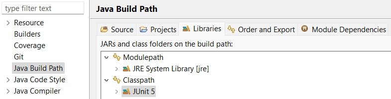
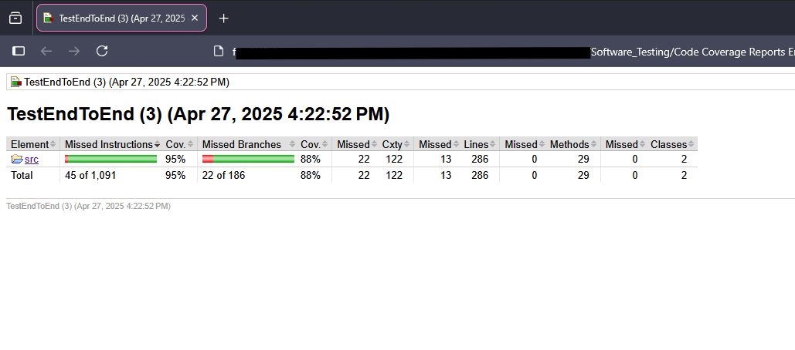
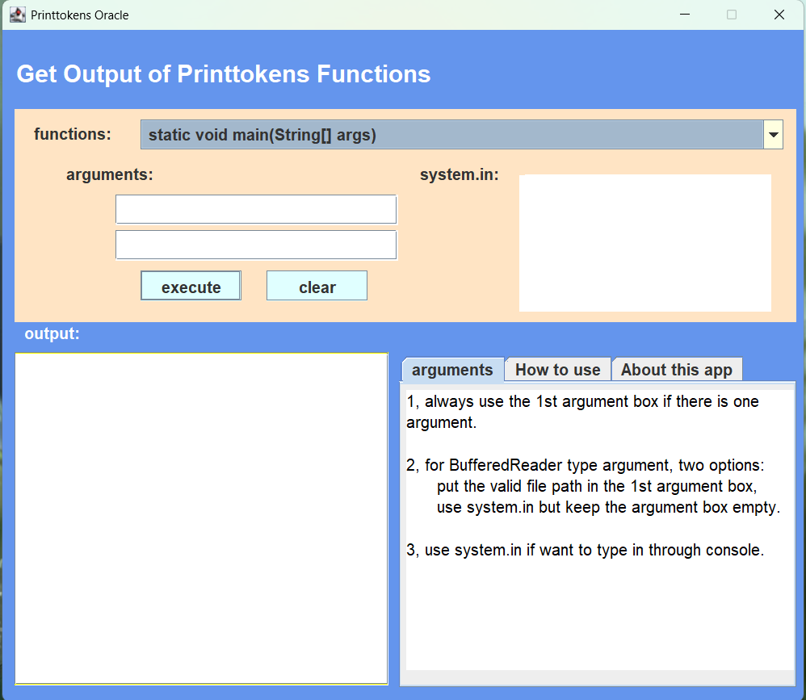

# Control-Flow Debugging: PrintTokens.java


This project performs control-flow testing on a fault-seeded Java program (`PrintTokens.java`). It demonstrates how to:

1. Analyze program structure using Control Flow Graphs (CFGs).
2. Design and execute test cases derived from control-flow paths.
3. Identify, record, and correct implementation faults.
4. Generate code coverage reports for Unit testing: maximize edge coverage for all non-main methods.
5. End-to-end testing: maximize edge coverage for all methods through the main method.

---

## 🧩 Project Breakdown

### 1. Test Case Preparation

* **Control Flow Graphs**
  A drawned version of CFGs for each method in `PrintTokens.java`, highlighting all branches and loops.

* **Test Path Enumeration**
  A List of all feasible paths through each CFG, covering:

  * Normal execution paths
  * Exception and boundary cases

* **Test Case Derivation**
  For each path, define input values and the expected output I used (Oracle). Capture expected token sequences and error messages.

### 2. Testing & Debugging

* **Test Implementation**
  I wrote JUnit test methods for each derived test case in `PrintTokensTest.java`. Which used assertions to compare actual vs. expected output.

* **Execution & Monitoring**
  Run tests via your IDE or command line. Observe correction.


### 3. Reporting

* **Coverage Reports**

  * **Unit Testing Report**: HTML report generated via JaCoCo plugin, showing method and branch coverage.
  * **End-to-End Testing Report**: HTML coverage report for full program execution, ensuring all token flows are exercised.

---

## ⚙️ Environment Setup

1. [Java SE 16](https://www.oracle.com/java/technologies/javase/jdk16-archive-downloads.html) (Need to create an account to download. This version is tested and other versions may work.)

2. [Eclipse IDE](https://riyagoel192.medium.com/how-to-download-eclipse-java-ide-on-windows-52608032d6d9) and [Jacoco](https://www.eclemma.org/installation.html#marketplace) through Eclipse IDE.

* **JUnit**: Add JUnit 5 to your project’s build path:

     1. Right-click project → **Build Path > Configure Build Path**.
     2. **Libraries** tab → **Add Library** → **JUnit** → **Next**.
     3. Choose **JUnit 5** → **Finish** → **Apply and Close**.
   * **JaCoCo**: Install via Eclipse Marketplace for coverage reports.
An example of Java Build Path with JUnit 5 added:


---

## Set up the Project Locally (Windows)

**1**  **Launch** Eclipse IDE

**2**  **Press** "**Ctrl+ALT+T**" to open the Terminal viewable in the IDE.

**3**  **Clone** the GitHub project repository locally using the Terminal.
  
**4**  **Execute** the clone command to download the repository.
  
**5**  **Enter** the downloaded repository folder

**6**  **Open** the project in Eclipse via "**File -> Open Projects from the File System...**" from the repository.


---

## 🚀 Running Tests & Generating Reports

### Unit Tests

```bash
# In terminal (using Maven or Gradle), or via Eclipse Run Configurations:
mvn test
# or
gradle test
```

Results appear in `target/surefire-reports/` or `build/reports/tests/`.

---

## Coverage Reports : Final Results

**📄 To check out Report/Result**

In this case, all report and cases have be complete.
* In the directory where you saved this repository go to ->**`Code Coverage Report EndToEnd`** -> Double click to * **`index.html`**
* The same is done for **`Code Coverage Report UnitTest`**



* Running the main program bug-free:

